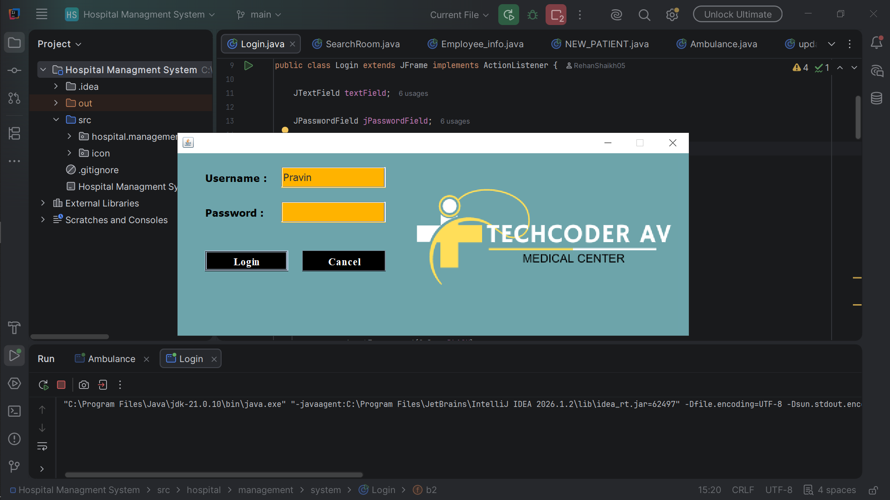
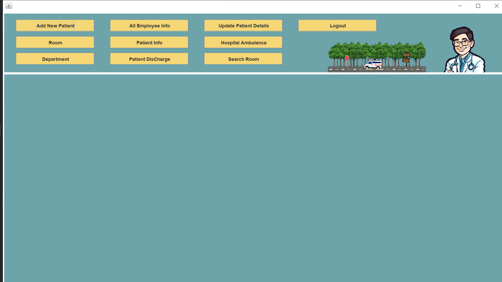
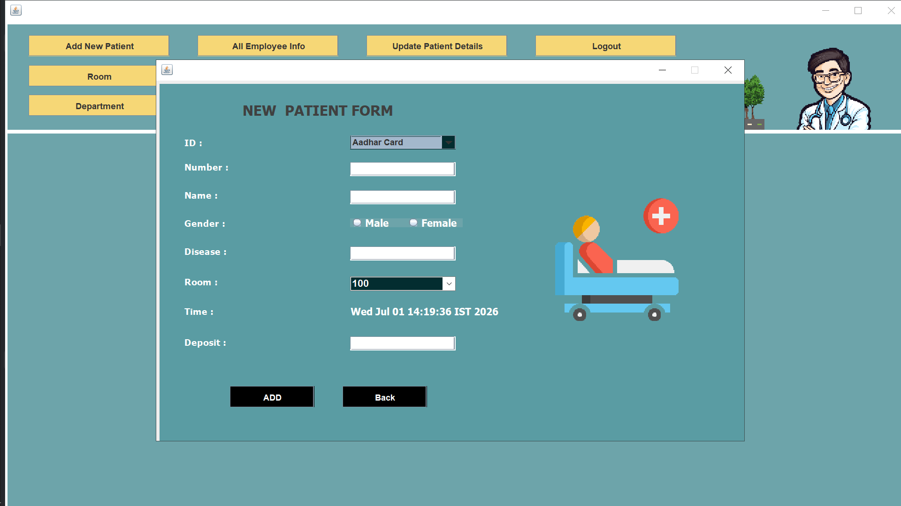
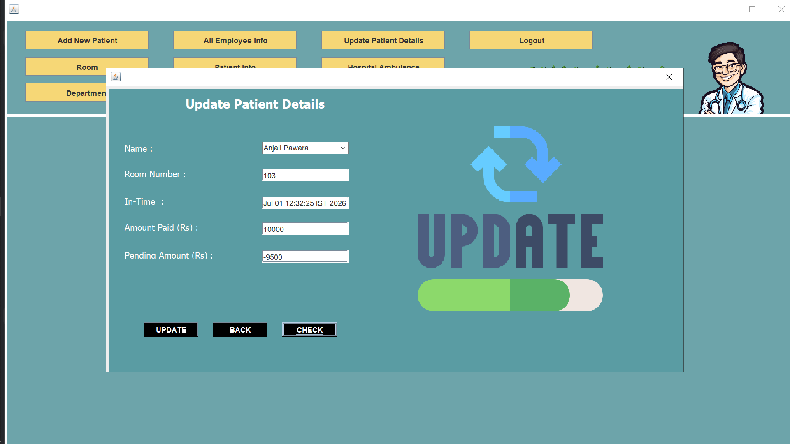
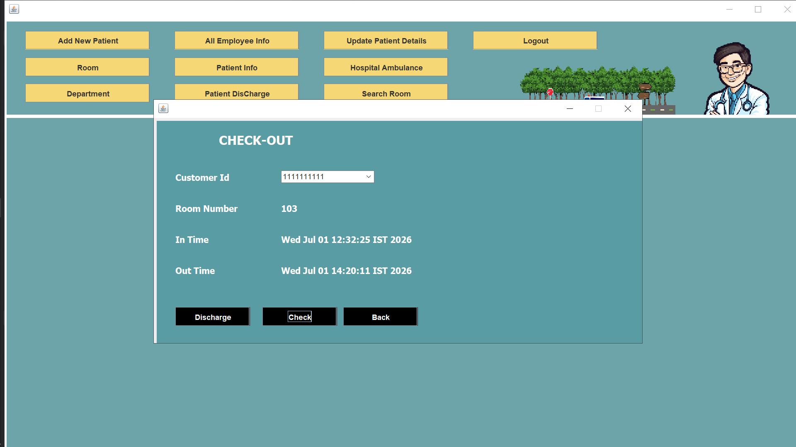
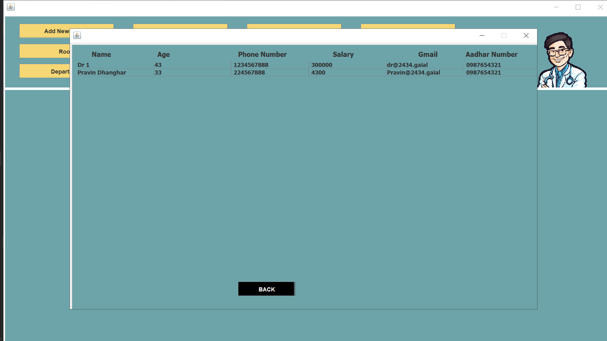
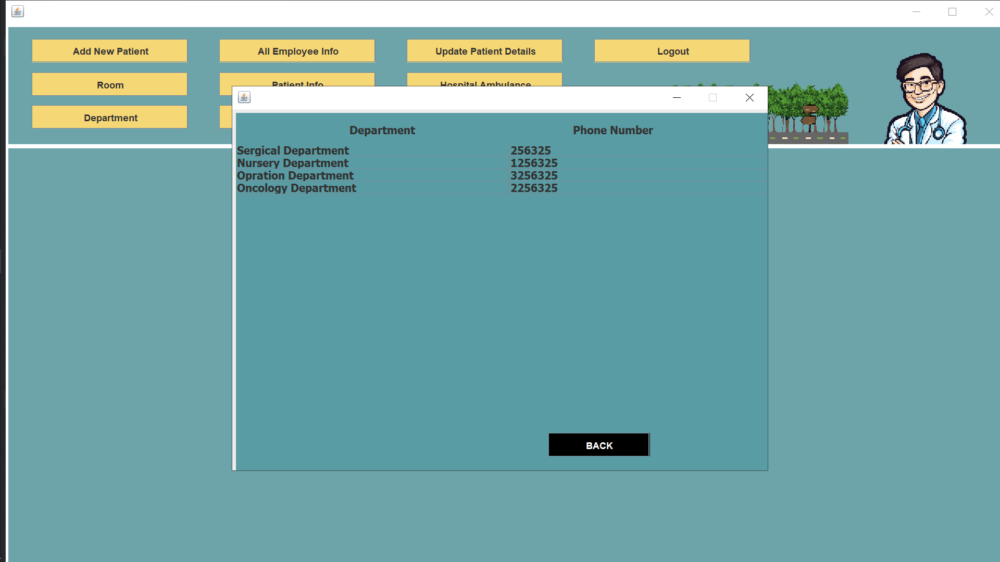
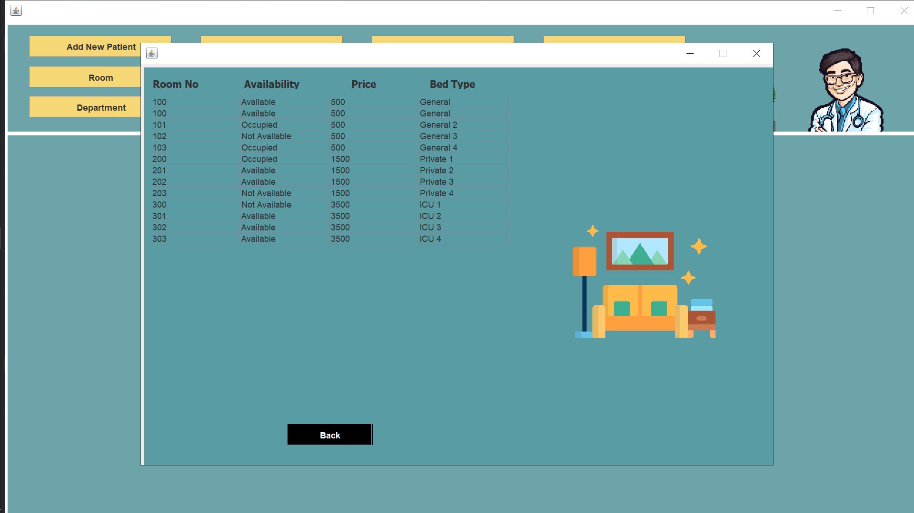
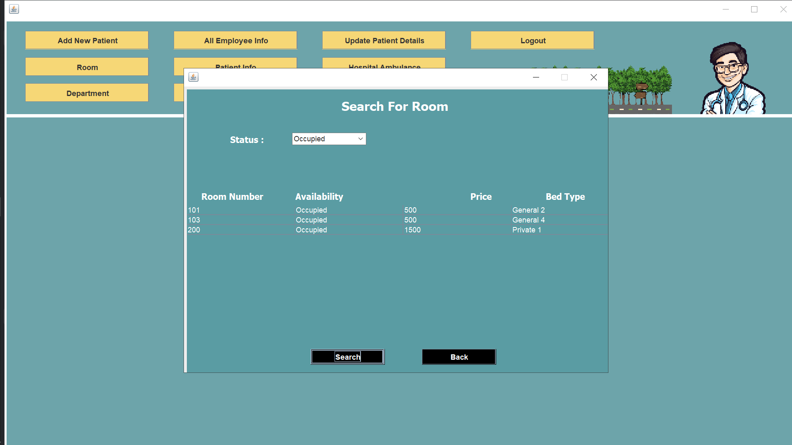
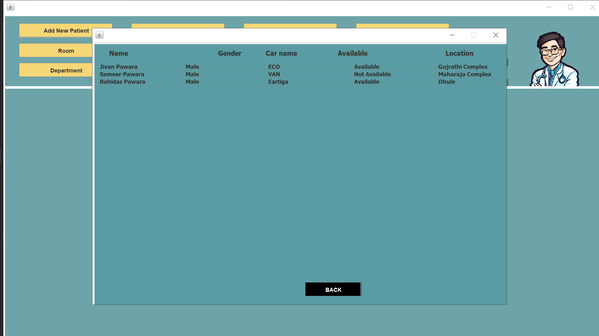

# 🏥 Hospital Management System

A desktop-based **Hospital Management System** developed using **Java, Swing, JDBC, and MySQL**. This application helps manage hospital operations such as patient registration, employee information, room availability, departments, ambulance details, and patient discharge through an easy-to-use graphical interface.

---

## ✨ Features

- 🔐 Secure Login System
- 🏠 Reception Dashboard
- 👨‍⚕️ Add New Patient
- 📋 View Patient Information
- ✏️ Update Patient Details
- 🚪 Patient Discharge
- 👨‍💼 Employee Information
- 🏥 Department Details
- 🛏️ Room Details
- 🔍 Search Room Availability
- 🚑 Ambulance Availability
- 💾 MySQL Database Connectivity

---

## 🛠️ Tech Stack

| Technology | Usage |
|------------|-------|
| Java | Core Programming |
| Swing | GUI Development |
| AWT | UI Components |
| JDBC | Database Connectivity |
| MySQL | Database |
| IntelliJ IDEA | IDE |

---

## 📂 Project Structure

```text
Hospital-Management-System
│
├── screenshots/
├── src/
│   └── hospital/
│       └── management/
│           └── system/
│               ├── Login.java
│               ├── Reception.java
│               ├── NEW_PATIENT.java
│               ├── ALL_Patient_Info.java
│               ├── update_patient_details.java
│               ├── patient_discharge.java
│               ├── Employee_info.java
│               ├── Department.java
│               ├── Room.java
│               ├── SearchRoom.java
│               ├── Ambulance.java
│               └── conn.java
│
├── README.md
└── .gitignore
```

---

# 🔑 Demo Login Credentials

**Username**

```text
Pravin
```

**Password**

```text
1234
```

---

# 📸 Project Screenshots

## 🔐 Login Page



---

## 🏠 Reception Dashboard



---

## 👨‍⚕️ Add New Patient



---

## 📋 Patient Information


---

## ✏️ Update Patient Details



---

## 🚪 Patient Discharge



---

## 👨‍💼 Employee Information



---

## 🏥 Department Details



---

## 🛏️ Room Details



---

## 🔍 Search Room Availability



---

## 🚑 Ambulance Availability



---

## ⚙️ Database Setup

1. Install **MySQL**.
2. Create a database.

```sql
CREATE DATABASE hospital;
```

3. Import the SQL database file.
4. Update the database username and password in `conn.java`.
5. Run `Login.java`.

---

## 🚀 How to Run

### Clone the Repository

```bash
git clone https://github.com/RehanShaikh05/Hospital-Management-System.git
```

### Open the Project

- Open using **IntelliJ IDEA** or **Eclipse**.
- Configure MySQL.
- Run the `Login.java` file.

---

## 📌 Future Improvements

- 📅 Appointment Booking
- 💊 Medicine Management
- 🧾 Report Generation
- 💳 Online Payment
- 📧 Email Notifications
- 👥 User Role Management

---

## 👨‍💻 Author

**Rehan Shaikh**

GitHub:  
https://github.com/RehanShaikh05

---

## ⭐ Support

If you found this project useful, please consider giving it a **⭐ Star** on GitHub.
